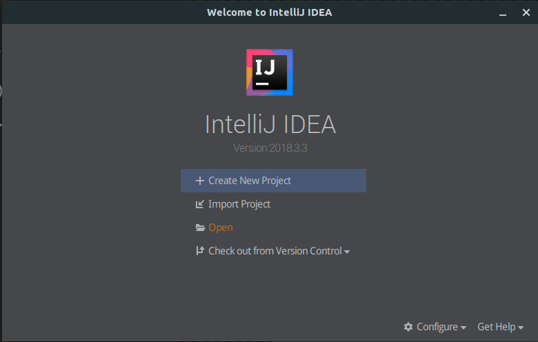
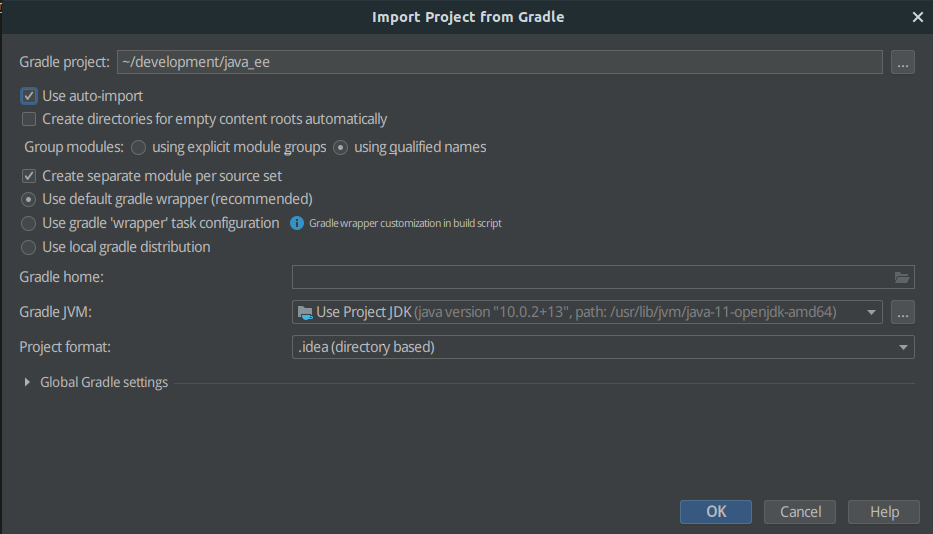
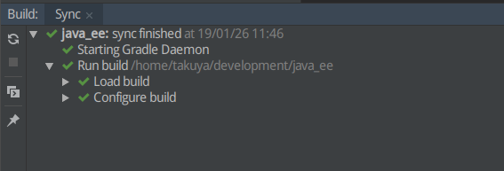
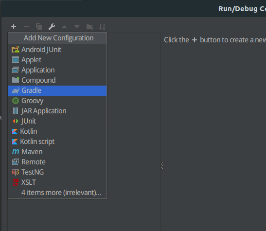
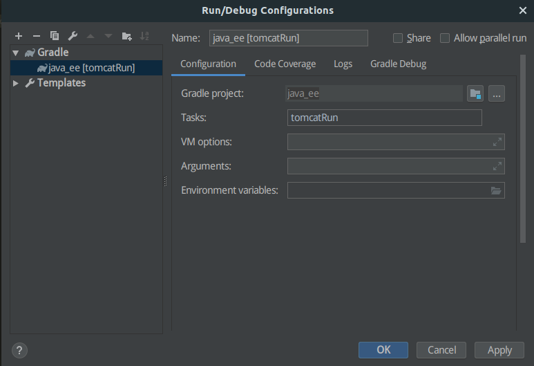
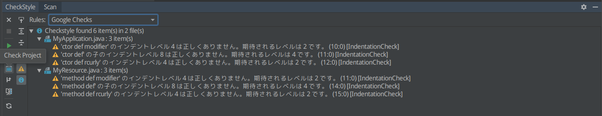
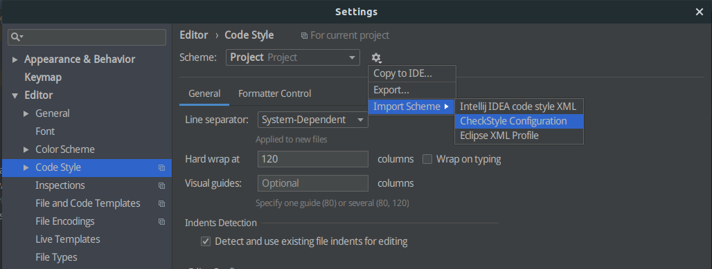
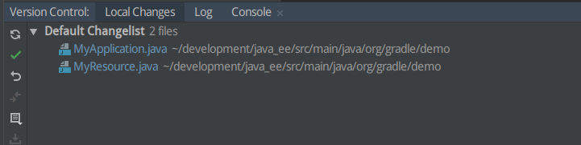
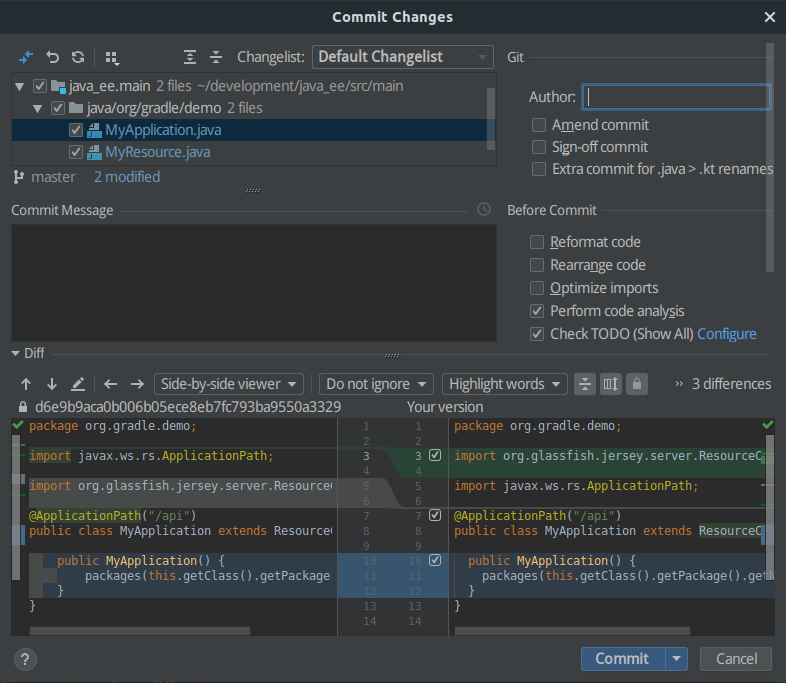

# Web Demo

```
> gradlew tomcatRun
```


## IntelliJ IDEA

IntelliJ IDEAでこのプロジェクトを開発するための手順です。IntelliJ IDEAのインストールは事前に行っておいてください。だいたい好みでいいですが、途中でGit, Gradleのプラグインを入れるか聞かれた場合は入れておいてください。

### Import

「Open」でこのフォルダを選択します。



Gradle関連のファイルが諸々存在するので、Gradleプロジェクトとしてインポートできます。以下の設定でインポートしてください。Gradle Wrapperを使うので、自前のGradle Homeを指定する必要はありません。Gradleが入っていたとしてもWrapperを使うことでメンバー全員のGradleバージョンを合わせることができます。



最初に「Import Project」でGradle選んでも同じかも。でもOpenすれば勝手にGradleプロジェクトとしてインポートできる。

### Gradleが正常に認識できているか

インポートしたら、画面下部`Build`タブの`Sync`が全て正常に終了していることを確認してください。ペイン自体がない場合は、Windowとかにいるかも、、、



### TomcatでRun

「Run」→「Edit Configurations...」で左上＋ボタンからGradleを選択します。実行するタスクなどを選択する画面がでてくるので、以下のように入力/選択します。

* **Gradle project**
  * このプロジェクト
  * フォルダアイコンをクリックすると出てくるはず
* **Tasks**
  * "tomcatRun"
  * Gradle projectにこのプロジェクトを指定しているので、build.gradleから実行可能なタスクが自動で補完されましたね？
* その他
  * 今回は入力なし





作成完了すると、`Run`タブに「Run/Debug 'java_ee [tomcatRun]'」が追加されます。試しに「Run 'java_ee [tomcatRun]'」を実行してアプリケーションがTomcatにデプロイされてアクセス可能となることを確認してください。

画面下のペインに`Run`が追加され、`12:07:53 INFO    http://localhost:8080/java_ee`までログが出力されればOK。`http://localhost:8080/java_ee/api/hello`にアクセスして、Hello Worldが表示されることを確認します。

```
12:07:46: Executing task 'tomcatRun'...

> Task :prepareInplaceWebAppFolder NO-SOURCE
> Task :createInplaceWebAppFolder
> Task :compileJava
> Task :processResources NO-SOURCE
> Task :classes
> Task :prepareInplaceWebAppClasses
> Task :prepareInplaceWebApp
〜 中略 〜
WARNING: An illegal reflective access operation has occurred
WARNING: Illegal reflective access by org.codehaus.groovy.reflection.CachedClass them. Skipping unneeded JARs during scanning can improve startup time and JSP compilation time.
1月 26, 2019 12:07:53 午後 org.apache.coyote.AbstractProtocol start
情報: Starting ProtocolHandler ["http-nio-8080"]
12:07:53 INFO  Tomcat 9.0.13 started and listening on port 8080
12:07:53 INFO  java_ee runs at:
12:07:53 INFO    http://localhost:8080/java_ee

> Task :tomcatRun
Press any key to stop the server.
```

ソースの変更を検知してリロードしてくれるけど少し遅い、、、

### コードフォーマット

「File」→「Settings」→「Plugins」からCheckStyle-IDEAをインストールしてください（IDEの再起動が必要）。

画面下のペインにCheckStyleが追加されています。

Rulesに「Google Checks」を選択し、Check Projectをするとエラーが出てきます。



自動で修正するためフォーマッタを定義します。（CheckStyle自体には修正機能がない？CheckStyleには"良くない書き方"とかも含まれるので、全部自動で修正できるわけではないから？）

「File」→「Settings」→「Editor」→「Code Style」で、このプロジェクトの`config/checkstyle/checkstyle.xml`をインポートします。`checkstyle.xml`はGoogle公式が出しているCheckStyleの定義で、`Google Checks`と一致している（はず？）。



インポートを行うと、その定義でフォーマットが設定されます。

`MyApplication.java`を開き、Ctrl + Alt + L でフォーマットします（`MyResource.java`も同様に）。

もう一度Google Checksでスキャンするとエラーがなくなっているはずです。

### Git



画面下のペインに「Version Control」タブがあります。それを開くと、修正ファイル一覧が出ます。ここから色々できます。試しにFormatした2ファイルをコミットしてみましょう。




